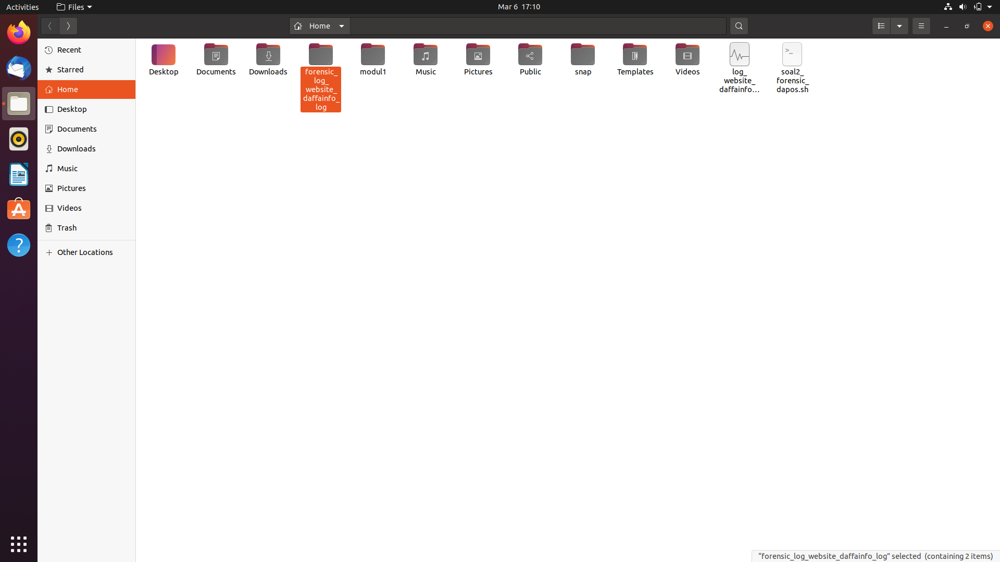
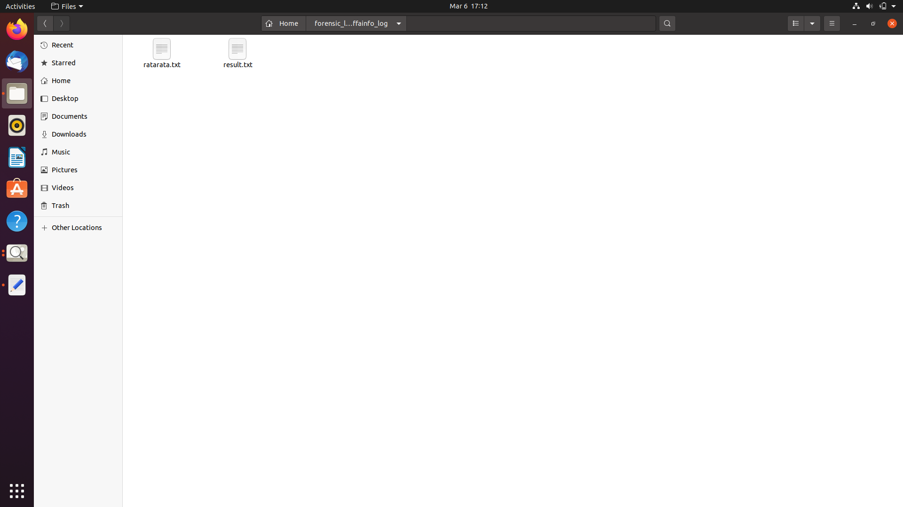
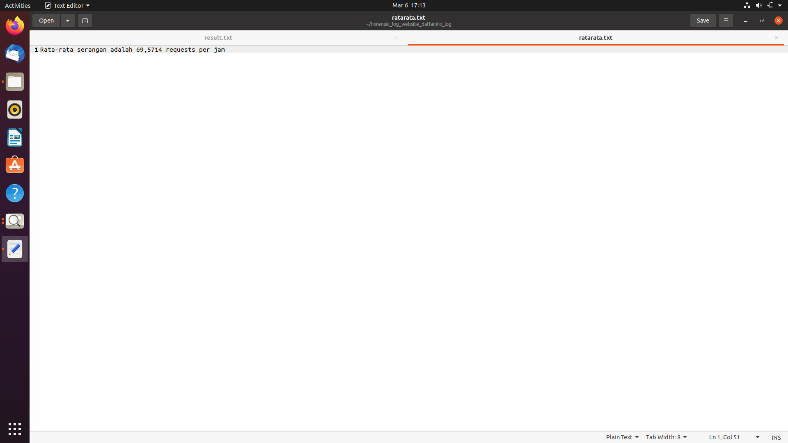
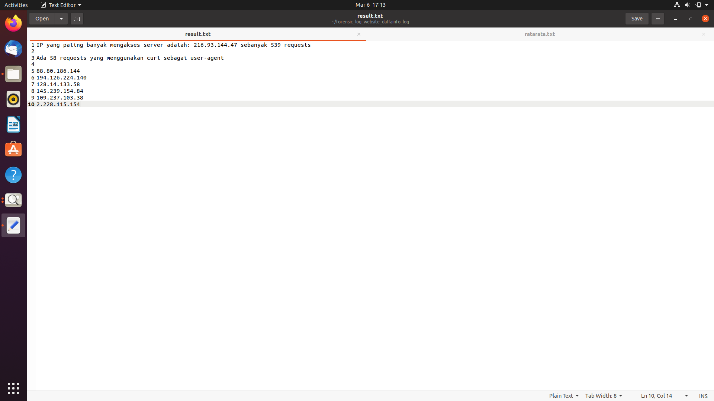

# Kelompok E10
    Eldenabih Tavirazin Lutvie    5025201213
    Hafiz Kurniawan               5025201032
    Michael Ariel Manihuruk       5025201188

# Soal 2
#### Progam
___
Pada studi kasus 2, kita akan mengidentifikasi log website daffa.info dimana file log directory log_website_daffainfo.log disimpan dalam variabel ``logLocation``. Serta hasil identifikasinya disimpan pada folder directory forensic_log_website_daffainfo_log disimpan dalam variabel ``folderLocation``.

Mulanya, membuat dahulu folder directory ``folderLocation`` untuk menyimpan hasil identifikasi. 
Kita akan mengecek apakah folder directorynya sudah ada, apabila sudah ada maka akan hapus directory tersebut dengan ``rm -rf $folderLocation``. Kemudian kita buat directory baru dengan ``mkdir $folderLocation``. Apabila belum ada directorynya maka akan membuat directory baru dengan ``mkdir $folderLocation``. Serta shebang ``!# /bin/bash`` jangan dilupakan.

```bash
#! /bin/bash

logLocation=/home/$USERNAME/log_website_daffainfo.log
folderLocation=/home/$USERNAME/forensic_log_website_daffainfo_log

if [[ -d "$folderLocation" ]]
then
	rm -rf $folderLocation
	mkdir $folderLocation
else
	mkdir $folderLocation
fi
```

Pada bagian ini, kita akan mencari berapa banyak rata-rata ip request per jamnya. kita akan identifikasi file log dengan ``cat $logLocation``. Kemudian ekstraksi file lognya dengan menggunakan ``awk`` dengan mencari pattern pada log dengan menggunakan ``gsub(/"/,"",$3)`` kemudian kita simpan hasilnya pada array ``collection``. Untuk mendapatkan hasil rata rata request per jam ``avg`` dengan membagi total ip request ``sum`` dengan banyak jam  ``count``.
Kita sudah mendapatkan ``avg`` lalu kita tampilkan dengan ``print`` dan hasilnya kita simpan pada file ``ratarata.txt`` didalam directory ``forensic_log_website_daffainfo_log`` dalam ``folderLocation``. Menyimpannya dapat dengan ``>> $folderLocation/ratarata.txt``.
```bash
cat $logLocation | awk -F: '{gsub(/"/,"",$3) collection[$3]++}
	END{
		for(i in collection ){
			count++
			sum+=collection[i]
		}
		avg=sum/count
		printf "Rata-rata serangan adalah " avg " requests per jam\n"
	}' >> $folderLocation/ratarata.txt
```

Pada bagian ini kita mencari ip paling banyak mengakses dan banyaknya akses ip tersebut. Kita akan identifikasi file log dengan ``cat $logLocation``. Kemudian kita ekstraksi log dengan menggunakan `awk` dengan mencari pattern pada log dengan menggunakan ``gsub(/"/, "", $1)`` kemudian ip yang didapatkan disimpan pada array ``ip``. Selanjutnya kita akan mencari ip paling banyak mengakses dengan membandingkan ``iptarget`` sebagai ip yang mengakses serta ``max`` sebagai banyaknya ip tersebut mengakses. Kita akan cetak output dengan ``print``. Hasilnya kita simpan pada file ``result.txt`` pada ``$folderlocation``.
```bash
cat $logLocation | awk -F: '{gsub(/"/, "", $1) ip[$1]++}
	END{
		max=0
		iptarget
		for( i in ip ){
			if(max < ip[i]){
				iptarget=i
				max=ip[iptarget]
			}
		}
		print "IP yang paling banyak mengakses server adalah: " iptarget " sebanyak " max " requests\n"
	}' >> $folderLocation/result.txt
```
Pada bagian ini kita mencari banyaknya ip request yang menggunakan curl user agent. Kita identifikasi file log dengan ``cat $logLocation``. Kita akan mencari log yang memuat string pattern ``curl`` .     Kemudian kita hitung dan disimpan pada variabel ``curlcount``. Output kita gunakan ``print`` dimana hasil tersebut disimpan dalam file ``result.txt`` didalam directory ``$folderLocation``.
```bash
cat $logLocation | awk '/curl/ {++curlcount}
	END{ 
		print "Ada " curlcount " requests yang menggunakan curl sebagai user-agent\n"
	}' >> $folderLocation/result.txt
```
Pada bagian ini kita akan mencari ip yang mengakses pada jam 02.00 - 02.59 pada tanggal 22 jan 2022. kita identifikasi log dengan ``cat $logLocation``. Kemudian kita akan cari string pattern yang memuat string 22 Jan 2022 dan jam 02.00 - 02.59 dengan ``/22/ && /Jan/ && /2022:02/``. kita simpan ip yang berada pada kolom ``$1`` pada array ``ip``. Kemudian kita cetak hasilnya dengan looping ``for`` pada array ``ip`` serta kita simpan pada file ``result.txt`` dalam directory
``forensic_log_website_daffainfo_log`` didalam ``$folderLocation``.

```bash
cat $logLocation | awk -F: ' /22/ && /Jan/ && /2022:02/ {gsub(/"/, "", $1)  ip[$1]++ }
	END{	
		for (i in ip){
			print i
		}
	}' >> $folderLocation/result.txt
```
## Output
___
Tampilan folder forensic_log_web_website_daffainfo_log yang dibuat.


Tampilan isi folder forensic_log_website_daffainfo_log yang memuat file ``ratarata.txt`` dan file ``result.txt``.


Tampilan hasil file ``ratarata.txt``.


Tampilan hasil file ``result.txt``.


## Kendala Pengerjaan
___
Kendala yang dialami ketika mengerjakan studi kasus 2 ini adalah langkah pengerjaan yang telah disusun tidak selalu membuahkan hasil yang selaras. Sehingga harus beradaptasi dengan mengubah langkah yang telah disusun.
___